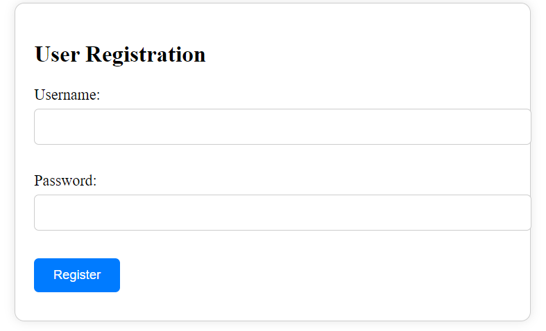

# User Authentication System

This project is a simple user authentication system that includes secure login and registration functionality. Users can sign up for an account, log in securely, and access protected routes only after successful authentication. The project uses Node.js, Express, PostgreSQL, and JSON Web Tokens (JWT) for authentication.

## Features

- User registration with hashed passwords
- Secure user login with JWT authentication
- Protected routes accessible only to authenticated users
- Environment variable configuration
- Basic front-end forms for registration and login

## Technologies Used

- Frontend: HTML, CSS, JavaScript
- Backend: Node.js, Express
- Database: PostgreSQL
- Authentication: JSON Web Tokens (JWT)
- Password Hashing: bcrypt

## Prerequisites

- Node.js and npm installed
- PostgreSQL database installed and running

